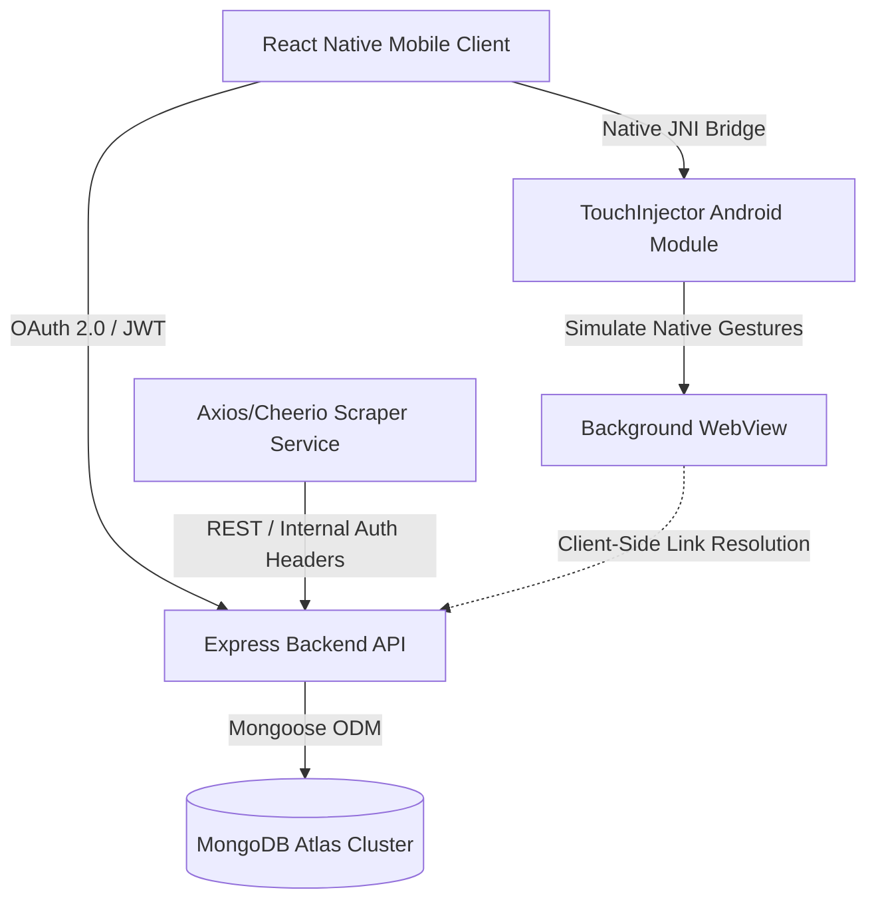
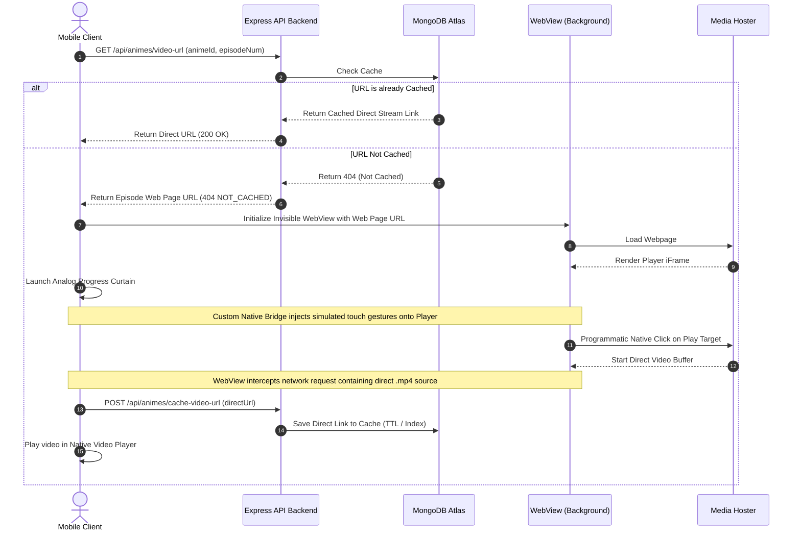

# 🎬 Clofthel | Mobile & Distributed Scraper Architecture

Clofthel is a highly optimized, multi-tier streaming and content aggregation platform. Rather than relying on a simple monolithic backend, the platform is architected as a distributed network of decoupled services communicating securely via API-key handshakes, custom native bridges, and JWT-authenticated sessions.

---

## 🏗️ Architecture Overview

The system is structured as a monorepo containing three core architectural pillars:



### 1. 📱 Mobile Client (Root Directory)
A cross-platform mobile application built using **React Native / Expo** providing a fluid interface for content exploration, bookmarks, and high-performance media playback.
* **Curtain WebView Pattern:** To extract direct video URLs from ad-heavy, anti-iframe hosters, the client instantiates an invisible `WebView` container. A custom UI loading curtain overlays it to present a clean, animated progress indicator while keeping the underlying web view active for interaction.
* **Hardware-Level Gesture Injection:** Integrates a custom React Native Java Native Interface (JNI) module to inject raw hardware-level motion events (`MotionEvent.ACTION_DOWN` / `ACTION_UP`) into the WebView hierarchy. This bypasses hoster security restrictions that block standard JavaScript `.click()` events.
* **Authentication:** Integrates Google Sign-In with backend token exchange protocols.

### 2. ⚡ Express API Backend (`/backend`)
A high-performance Node.js & Express REST API server acting as the central state controller and media catalog.
* **Security & Auth:** Restricts routes using custom JWT validation middlewares, Google token validation, and verified client headers signed via `MOBILE_APP_SECRET` to prevent unauthorized API requests.
* **Database Management:** Interfaces with MongoDB Atlas utilizing replica sets, custom indexing (`tranimeizle_slug`, `anilist_id`), and Mongoose schemas to cache resolved streams.
* **Proxy Server:** Incorporates a custom streaming proxy to bypass CORS policies and Referer constraints from external video providers, ensuring direct client-side playback.

### 3. 🤖 Scraper Microservice (`/scraper-service`)
A standalone web-scraping daemon driven by **Axios & Cheerio** designed to index records in real-time.
* **Scraping Routine:** Executes dynamic target navigation (`sync_homepage.js`) to parse updates from host directories.
* **Automation Scheduler:** Leverages `node-cron` jobs to run background sweeps 5 times a day (02:00, 08:00, 12:00, 16:00, 20:00).
* **Inter-Service Notifications:** Automatically notifies the central Express backend of new episodes to dispatch real-time push notifications.
* **Standalone Execution:** Supports command-line triggering (`run_once.js`) for system administrators.

---

## 🛠️ Technical Deep Dive & Core Pillars

### A. The Native Touch Injection Bridge (`TouchInjector`)
Many premium video hosters detect programmatic JavaScript click triggers and block them to protect their advertising overlays. To bypass this, Clofthel features a custom native Java module (`TouchInjectorModule.java`) loaded into the React Native runtime:

1. **View Resolution:** The JavaScript thread passes the React View Tag of the active WebView container.
2. **Thread Marshalling:** The module shifts execution to the Android UI thread (`runOnUiQueueThread`).
3. **Android View Lookup:** Resolves the raw `android.view.View` hierarchy using Fabric-compatible `UIManagerHelper` and legacy `UIManagerModule` fallbacks.
4. **MotionEvent Dispatching:** Generates and dispatches physical touch gestures directly into the resolved view's input stream:
   ```java
   long downTime = SystemClock.uptimeMillis();
   MotionEvent downEvent = MotionEvent.obtain(downTime, downTime, MotionEvent.ACTION_DOWN, physicalX, physicalY, 0);
   view.dispatchTouchEvent(downEvent);
   
   MotionEvent upEvent = MotionEvent.obtain(downTime, downTime + 50, MotionEvent.ACTION_UP, physicalX, physicalY, 0);
   view.dispatchTouchEvent(upEvent);
   ```

### B. Client-Side Video Link Resolution Flow
When a user requests an episode, the system resolves media links in a multi-stage fallback cycle:



---

## 🛠️ Tech Stack & Core Dependencies

| Tier | Component | Technology Used |
| :--- | :--- | :--- |
| **Mobile Client** | UI & Routing | React Native, Expo (SDK 54), React Navigation v7, Expo Video |
| | Native Modules | Java, JNI Bridges (`TouchInjectorModule`) |
| **Backend API** | Server Engine | Node.js, Express, Mongoose ODM |
| | Security | JWT (JSON Web Tokens), Google Auth APIs, CORS limits |
| **Microservice**| Scraper Engine | Axios, Cheerio, Node-Cron |
| **Database** | Storage | MongoDB Atlas (Replica Sets) |

---

## ⚙️ Environment Variables Config

Each service requires specific environment files to boot up.

### `/backend/.env`
```env
MONGO_URI=mongodb+srv://<user>:<password>@cluster.mongodb.net/clofthel_db
PORT=5000
GOOGLE_CLIENT_ID=your_google_web_client_id.apps.googleusercontent.com
JWT_SECRET=your_secure_jwt_secret_token
INTERNAL_API_KEY=your_internal_service_handshake_key
MOBILE_APP_SECRET=your_mobile_client_verification_secret
GROQ_API_KEY=optional_ai_integration_key
RESEND_API_KEY=optional_email_service_key
```

### `/scraper-service/.env`
```env
MONGO_URI=mongodb+srv://<user>:<password>@cluster.mongodb.net/clofthel_db
MAIN_BACKEND_URL=http://localhost:5000
INTERNAL_API_KEY=your_internal_service_handshake_key
```

---

## 🚀 Getting Started & Local Setup

### 1. Prerequisites
* **Node.js:** version 18.0.0 or higher.
* **Android SDK:** required to compile custom native Android code (`TouchInjector`).

### 2. Setup & Start Scraper Microservice
```bash
cd scraper-service
npm install
node server.js
```
> [!TIP]
> You can trigger the scraper database synchronization routine manually outside of schedules by running:
> `node run_once.js`

### 3. Setup & Start Express Backend
```bash
cd backend
npm install
node server.js
```

### 4. Run Mobile App
```bash
# From the project root
npm install
npx expo start
```

### 5. Build Release APK (Android)
To compile the application containing the custom Java Native Touch injection modules:
```bash
cd android
# Windows Powershell
./gradlew assembleRelease
```
The compiled output will be generated at `./android/app/build/outputs/apk/release/app-release.apk`.

---
*Architected and developed by Bedirhan İmer.*
