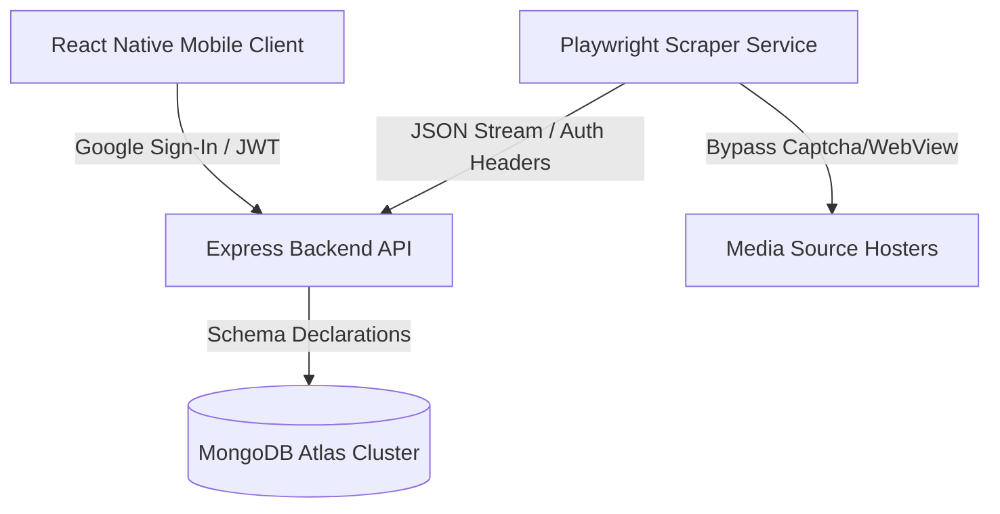

# 🎬 Clofthel | Mobile & Distributed Scraper Architecture

Clofthel is a highly optimized, multi-tier system engineered to scrape, process, and stream media content. Rather than relying on a simple monolithic backend, the platform is divided into decoupled services communicating securely via API-key handshakes and JWT sessions.

## 🏗️ Architecture Overview

The project is structured as a monorepo containing three core components:



### 1. 📱 Mobile App (Root Directory)
A cross-platform mobile application built with **React Native / Expo** providing a fluid interface for content exploration and media playback.
* **Under the Hood Bypass:** Leverages an invisible background WebView (curtain layer) inside React Native. It bypasses hoster security by mapping dynamic canvas coordinates and injecting simulated touch events to extract video links programmatically.
* **Authentication:** Integrates Google Sign-In with backend token exchange protocols.

### 2. ⚡ Express API Backend (`/backend`)
A high-performance Node.js & Express REST API server acting as the central state controller.
* **Security & Auth:** Restricts routes using custom JWT validation middlewares and verified client tokens via `MOBILE_APP_SECRET`.
* **Database Management:** Interfaces with MongoDB Atlas utilizing replica sets and flexible schema patterns (Mixed types) for fast retrieval.

### 3. 🤖 Scraper Microservice (`/scraper-service`)
A standalone web-scraping daemon driven by **Playwright / Headless Browser engines** to sweep, extract, and index records.
* **Scraping Routine:** Executes dynamic target navigation (`sync_homepage.js`) to parse updates.
* **Automation Scheduler:** Leverages `node-cron` jobs to run background sweeps every 24 hours.
* **Bypass Tactics:** Includes custom anti-fingerprinting configurations and header rotations to emulate organic user behavior.

---

## 🛠️ Tech Stack & Dependencies

* **Frontend/Mobile:** React Native, Expo, React Context API, WebView
* **Backend:** Node.js, Express, Mongoose, JWT (JSON Web Tokens)
* **Scraper Engine:** Playwright (Headless Chromium), Node-Cron
* **Database:** MongoDB Atlas (Replica Sets)

---

## 🚀 Getting Started

### Prerequisites
* Node.js (v18+)
* MongoDB connection string
* Firebase / Expo credentials

### 1. Setup Scraper Service
```bash
cd scraper-service
npm install
# Configure your .env variables:
# MONGODB_URI=your_mongodb_connection
# BACKEND_SECRET_KEY=your_token
node server.js
```

### 2. Setup Express Backend
```bash
cd backend
npm install
# Configure your .env variables:
# PORT=5000
# MONGODB_URI=your_mongodb_connection
# JWT_SECRET=your_secret_key
# MOBILE_APP_SECRET=your_mobile_hash
node server.js
```

### 3. Run Mobile App
```bash
# In the root directory
npm install
npx expo start
```

---
*Architected and developed by Bedirhan İmer.*
