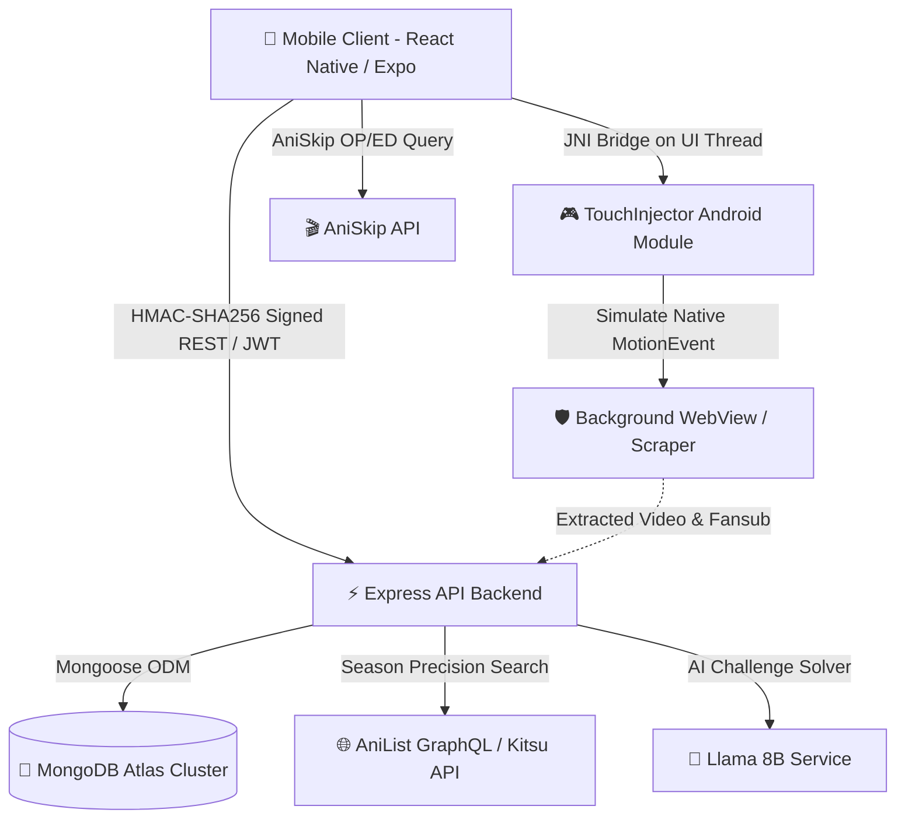

<p align="center">
  
</p>

<h1 align="center">Clofthel — Next-Generation Anime Streaming & Distributed Aggregation Platform</h1>

<p align="center">
  <b>Dual-Core Orchestration • Hardware-Level JNI Touch Injection • Self-Learning On-Demand Scraper • Fansub-Aware AniSkip Intro Skipping</b>
</p>

<p align="center">
  
  
  
  
  
  
</p>

---

## 🌟 Overview & System Highlights

**Clofthel** is an enterprise-grade, multi-tier streaming and content aggregation ecosystem engineered for uncompromising speed, visual clarity, and full automation. Rather than relying on fragile monolithic scrapers, Clofthel features an autonomous **Dual-Core Architecture** combining client-side hardware-level gesture execution, real-time on-demand self-healing, precision season alignment with AniList, and fansub-specific intro skipping.


```mermaid
graph TD
    A[📱 Mobile Client - React Native / Expo] -->|HMAC-SHA256 Signed REST / JWT| B[⚡ Express API Backend]
    A -->|JNI Bridge on UI Thread| C[🎮 TouchInjector Android Module]
    C -->|Simulate Native MotionEvent| D[🛡️ Background WebView / Scraper]
    B -->|Mongoose ODM| E[(🍃 MongoDB Atlas Cluster)]
    B -->|Season Precision Search| F[🌐 AniList GraphQL / Kitsu API]
    B -->|AI Challenge Solver| G[🤖 Llama 8B Service]
    D -.->|Extracted Video & Fansub| B
    A -->|AniSkip OP/ED Query| H[🎬 AniSkip API]
```

---

## 🚀 Key Architectural Pillars & Innovations

### 1. 🛡️ Autonomous Network Challenge & Turnstile Bypass (`TouchInjector`)
Anti-bot systems (Cloudflare Turnstile, image verification, residential proxy checks) actively detect and block synthetic JavaScript `.click()` calls. Clofthel eliminates this barrier at the hardware level:
* **Android UI Thread Dispatch:** Uses custom JNI bindings (`TouchInjector.java`) executing directly on the Android UI Thread via `runOnUiQueueThread`.
* **Hardware Motion Events:** Converts CSS element bounds into physical hardware coordinates $(x \times \text{devicePixelRatio}, y \times \text{devicePixelRatio})$ and dispatches genuine `MotionEvent.ACTION_DOWN` and `MotionEvent.ACTION_UP` gestures.
* **Turnstile Token Observer:** Continuously observes `input[name="cf-turnstile-response"]`. The EXACT millisecond the token arrives, a native hardware tap is dispatched to the Submit button.
* **Self-Learning AI Hybrid Solver:**
  $$\text{Device Local Cache (0ms)} \longrightarrow \text{Central DB Question Pool} \longrightarrow \text{Llama 8B AI Service}$$
  Answers are memorized globally across all users to prevent redundant solving.

---

### 2. 🔄 Self-Healing On-Demand Scraper & Dual Sync (`animeSelfHealer.js`)
If an anime has missing episodes or has never been indexed before, the system triggers an instantaneous, zero-delay on-demand self-healing sweep:
* **Overview Page Scraping:** Queries the anime's root directory page (`https://www.tranimeizle.io/anime/[slug]`) rather than individual episode pages.
* **Full Metadata Extraction:** Extracts official English/Romaji aliases (*Diğer İsimleri*), poster imagery, genres, episode maps, and translation teams (*Fansublar*).
* **Dual-Target MongoDB Sync:**
  1. **Target A (`animes` collection):** Upserts the anime record with all episode stream endpoints.
  2. **Target B (`orchestrator_state` collection):** Links the new season into its canonical franchise group and immediately refreshes the in-memory RAM cache.

---

### 3. 🎯 Precision Season & Part AniList Matcher (`anilistSeasonMatcher.js`)
Generic title searches often misassign sequel seasons (e.g., *Season 2 Part 2* getting mapped to *Season 1*'s AniList ID). Clofthel implements an exact heuristic scoring engine:
* **Attribute Discrimination:** Detects season numbers (*2. Sezon*, *Season 2*), part divisions (*2. Kısım*, *Part 2*, *Cour 2*), and formats (*Movie*, *TV*, *OVA*, *Special*).
* **Tranimeizle Alias Matching:** Matches official alternative names against AniList synonyms for a **+100 score boost**.
* **Penalty Elimination:** Penalizes Season 1 candidates when querying for Season 2+ to guarantee 100% correct AniList ID assignment.

---

### 4. ⚡ Fansub-Aware AniSkip Intro Skipping (`aniSkipService.js`)
Turkish fansub teams (e.g., *Seicode*, *TAÇE*, *FGL Çeviri*, *TRanimeizle*, *Tempura*) frequently prepend custom intro bumpers (5s to 12s) to episode streams, causing standard AniSkip timestamps to desynchronize.
* **Per-Episode Fansub Tracking:** When a stream link is resolved, the scraper identifies the exact translation team for that specific source and persists it into `episodes_cache[episodeNumber]`.
* **Dynamic Time Adjustment:**
  $$\text{Adjusted Start} = \text{AniSkip OP Start} + \text{Fansub Offset}$$
  $$\text{Adjusted End} = \text{AniSkip OP End} + \text{Fansub Offset}$$
* **Versioned Database Sync:** Fansub offsets are synced on app launch against `/api/v1/fansub-offsets` with automatic versioning.
* **Interactive Player HUD:** Displays an animated **"İntroyu Geç (Skip Intro)"** button that skips to **3 seconds before intro finish** on one tap.

---

## 🛠️ Technology Stack

| Layer | Component | Technologies |
| :--- | :--- | :--- |
| **Mobile App** | Interface & Media | React Native 0.81.5, Expo SDK 54, Expo Video, Reanimated 4, React Navigation v7 |
| | Native Modules | Java, JNI MotionEvent Injection (`TouchInjector`), UltraClarity View |
| **Backend API** | Server & Security | Node.js v24, Express.js, Mongoose ODM, Helmet, XSS-Clean, HMAC-SHA256 Signatures |
| **Data & AI** | Persistence & Solvers | MongoDB Atlas Cluster, Llama 8B, AniList GraphQL, Kitsu API, AniSkip API |
| **DevOps & CI/CD** | Automation | GitHub Actions (Node 24, Gradle Android Build, GitHub Releases), Render Deployment |

---

## ⚙️ Environment Configuration

### `/backend/.env`
```env
PORT=5000
MONGO_URI=mongodb+srv://<user>:<password>@cluster.mongodb.net/clofthel_db
JWT_SECRET=your_super_secret_jwt_key
MOBILE_APP_SECRET=your_hmac_sha256_client_verification_secret
GROQ_API_KEY=your_llama_8b_groq_api_key
RESEND_API_KEY=your_resend_email_api_key
GOOGLE_CLIENT_ID=your_google_web_client_id.apps.googleusercontent.com
```

### `/src/constants/config.js`
App version and build codes are dynamically loaded from `app.json`:
```javascript
export const API_BASE_URL = 'https://api.clofthel.com.tr/api';
export const APP_VERSION = Constants?.expoConfig?.version || '1.4.0';
export const APP_BUILD_CODE = Constants?.expoConfig?.android?.versionCode || 140;
```

---

## 🚀 Running Locally & Building

### 1. Backend API
```bash
cd backend
npm install
npm run dev
```

### 2. React Native Client
```bash
# In the root directory
npm install
npx expo start
```

### 3. Compiling Android Release APK
```bash
cd android
./gradlew assembleRelease --no-daemon -PreactNativeArchitectures=armeabi-v7a,arm64-v8a
```
Compiled APK: `./android/app/build/outputs/apk/release/app-release.apk`

---

<p align="center">
  <sub>Architected and developed with ❤️ for the anime community by <b>Bedirhan İmer</b>.</sub>
</p>
